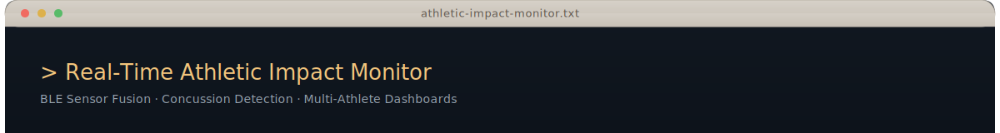

<div align="center">
  
</div>

<br>

## Overview

MouthguardMonitor is a React Native mobile application for real-time monitoring of instrumented athletic mouthguard sensors. The app connects via Bluetooth Low Energy to custom mouthguard hardware containing six sensor channels — IMU (gyroscope, magnetometer), dual-range accelerometer (16g + 200g), oral temperature, heart rate, and bite force — streaming telemetry in real time while computing impact severity and cumulative concussion risk on-device. All data is persisted locally in SQLite through a typed repository layer with versioned migrations, and presented through sixteen specialized chart components across a six-tab coaching interface. The system supports simultaneous multi-device connections for monitoring an entire athletic roster from a single coach device, with iOS Core Bluetooth state restoration for persistent background connectivity. Purely offline-first — no backend, no cloud dependency.

<br>

## Technology Stack

<table>
  <tr>
    <td><strong>Framework</strong></td>
    <td>
      
      
    </td>
  </tr>
  <tr>
    <td><strong>Language</strong></td>
    <td>
      
    </td>
  </tr>
  <tr>
    <td><strong>BLE Communication</strong></td>
    <td>
      
    </td>
  </tr>
  <tr>
    <td><strong>Database</strong></td>
    <td>
      
      
    </td>
  </tr>
  <tr>
    <td><strong>Navigation</strong></td>
    <td>
      
    </td>
  </tr>
  <tr>
    <td><strong>Visualization</strong></td>
    <td>
      
      
    </td>
  </tr>
  <tr>
    <td><strong>Animations</strong></td>
    <td>
      
      
      
    </td>
  </tr>
  <tr>
    <td><strong>Platforms</strong></td>
    <td>
      
      
    </td>
  </tr>
  <tr>
    <td><strong>Testing</strong></td>
    <td>
      
    </td>
  </tr>
</table>

## Engineering Principles

### 1. Stream sensor data in real time

The app subscribes to four custom BLE characteristics simultaneously — heart rate, oral temperature, inertial measurement, and bite force — parsing binary packets at the hardware clock rate. Sensor readings flow through a typed pipeline from raw bytes to stored records to chart-ready data, with UI updates throttled to 4 Hz to maintain responsive interaction during continuous streaming.

> **Goal:** Eliminate latency between physical event and visual feedback — a coach sees what the sensor sees.

### 2. Detect impacts immediately at the edge

Every acceleration reading is evaluated against an 80g threshold in real time. When an impact is detected, the system records the event with timestamp, magnitude, and device context, classifies severity, updates cumulative exposure counters, and emits a concussion alert — all locally, without network dependency.

> **Goal:** Concussion risk decisions happen on-device, in milliseconds, regardless of connectivity.

### 3. Preserve every sensor reading locally

All sensor data is written to SQLite through typed repositories, with session-scoped foreign keys and a versioned migration system (v1–v4). Impact events are retained indefinitely; raw sensor data follows a 7-day lifecycle. No data depends on network availability.

> **Goal:** A complete, queryable record of every training session exists on the device — no cloud required.

### 4. Manage multiple devices simultaneously

The BLE layer supports concurrent connections to multiple mouthguard devices, each assigned to a specific athlete. Device state, connection lifecycle, and data routing are managed per-device, with iOS Core Bluetooth state restoration preserving connections across background transitions.

> **Goal:** One coach device monitors an entire roster — connections survive app backgrounding.

---

## Real-Time BLE Sensor Pipeline

The app communicates with custom mouthguard hardware over four dedicated BLE services, each exposing a characteristic that streams binary sensor packets. The `BluetoothService` orchestrates device scanning, connection management, and characteristic subscriptions, while the `BluetoothHandler` manages low-level BLE state and iOS background restoration.

### Sensor Channels

| Service | UUID Prefix | Data | Packet Format |
| :--- | :--- | :--- | :--- |
| **HRM** | `a329162e` | Heart rate | BLE HRM characteristic spec |
| **HTM** | `d2a95330` | Oral temperature | IEEE-11073 FLOAT (Health Thermometer) |
| **IMU** | `5f07ce79` | Gyroscope, dual accelerometer, magnetometer, bite force | 28-byte binary: int16x12 + uint16x2 + uint32 |
| **FSR** | `56f38df0` | Bite force (left / right) | int16x2 + uint32 timestamp |
| **Battery** | `180f` | Battery level | Standard BLE Battery Service |

The IMU packet is the most complex: three axes each for gyroscope, 16g accelerometer, 200g accelerometer, and magnetometer, plus dual bite force channels and a device timestamp — 28 bytes of tightly-packed sensor state decoded per frame.

> **Guarantee:** Every characteristic notification is parsed, typed, and persisted to SQLite within the same event loop tick. No sensor reading is silently dropped.

---

## Concussion Detection Engine

Impact detection runs on every incoming acceleration reading from the 200g accelerometer. When the resultant magnitude exceeds **80g**, the system records an impact event, classifies its severity, and updates the athlete's cumulative risk profile for the active session.

### Severity Classification

| Level | Criteria |
| :--- | :--- |
| **Critical** | 3+ severe impacts OR peak magnitude >= 150g |
| **High** | 2+ severe impacts OR peak magnitude >= 120g |
| **Moderate** | 1+ severe impact OR peak magnitude >= 90g |
| **Low** | Default — no severe impacts, peak < 90g |

Risk assessment is cumulative within a session: each new impact re-evaluates the athlete's risk level by considering the full impact history — count, peak magnitude, and severity distribution. When risk elevates, a `CONCUSSION_DETECTED` event is emitted through the custom `EventEmitter`, triggering an immediate full-screen alert overlay on the coach's device.

Additional physiological guardrails monitor heart rate (40–190 bpm safe range) and oral temperature (35–39 C safe range), flagging readings outside these bounds as anomalies.

> **Guarantee:** An impact above threshold triggers classification, recording, and alert within a single event cycle. Risk assessment always reflects the complete session impact history.

---

## Multi-Sensor Visualization

Sixteen specialized chart components transform raw sensor data into interactive dashboards. Pure processing functions in `dataProcessing.ts` convert stored packets into chart-ready arrays with subsampling (max 100 data points) and statistical summaries (min, max, average, peak).

### Visualization Components

| Sensor Domain | Components |
| :--- | :--- |
| **Impact Analysis** | Concussion Risk Gauge, Impact Timeline, Severity Distribution, Cumulative Exposure |
| **Heart Rate** | Heart Rate Trend, Scrollable Heart Rate Chart |
| **Temperature** | Temperature Stability, Scrollable Temperature Chart |
| **Motion** | Motion Overview, Scrollable Motion Chart |
| **Bite Force** | Bite Force Dynamics Chart |
| **Aggregates** | Bar Chart, Line Chart, Weekly Overview, Monthly Overview |

Each scrollable chart variant supports horizontal pan and gesture-based interaction. The dashboard composes these components with tab-level navigation across six views: Dashboard, Sessions, Athletes & Devices, Live Monitor, Reports, and Coach.

> **Guarantee:** All chart data is derived from stored sensor readings through pure transformation functions. No visualization displays fabricated or simulated data during live monitoring.

---

## Hardest Problems Solved

### 1. Real-time multi-channel binary packet parsing

**Problem:** Four BLE characteristics stream binary data simultaneously — the IMU packet alone encodes 14 sensor values into 28 bytes using mixed int16/uint16/uint32 representations. Parsing must be correct at the byte level, fast enough to avoid back-pressure on the BLE stack, and routed to the correct per-device, per-athlete data path.

**Solution:** Each characteristic subscription decodes its binary payload through a typed parser that extracts values at known byte offsets with explicit endianness handling. The IMU parser unpacks three-axis data for four sensor types plus dual bite force and timestamp in a single pass. Parsed packets are immediately written to SQLite through the `SensorDataRepository`, with the active session ID attached at write time. Device-athlete routing is resolved at connection time and cached for the session lifetime.

### 2. Cumulative concussion risk from dual-range accelerometer data

**Problem:** A single accelerometer cannot serve both precision (low-g movements) and capture (high-g impacts). Concussion risk depends not just on a single reading but on the accumulation of impacts over a session — peak magnitude, impact count, and severity distribution all contribute to the assessment.

**Solution:** The hardware exposes both a 16g and a 200g accelerometer. The 200g channel is used for impact detection (it won't saturate during head impacts that routinely exceed 50g), while the 16g channel provides higher resolution for motion analysis. The risk classifier evaluates the full session impact history on every new event, computing a multi-factor risk level from thresholds on peak g-force, severe impact count, and cumulative exposure. The classification is stateless — given the same impact history, it always produces the same risk level.

### 3. Multi-device BLE lifecycle with iOS background persistence

**Problem:** A coach device must maintain simultaneous BLE connections to multiple mouthguards throughout a training session, including when the app is backgrounded on iOS. iOS aggressively suspends BLE peripherals, and connection state must survive app state transitions without data loss.

**Solution:** The `BluetoothHandler` uses iOS Core Bluetooth state restoration with a dedicated restoration identifier. On app resume, pending connections and active subscriptions are re-established from the restored state. Each device connection is tracked independently with its own subscription set and athlete assignment. The `BluetoothService` layer manages the connection lifecycle (scan, connect, discover, subscribe, monitor) as a state machine per device, with automatic reconnection on unexpected disconnects.

<br>

## Layering and System Domains

| Layer | Component | Responsibility |
| :--- | :--- | :--- |
| **Screen** | Expo Router tab screens | User interaction, chart rendering, navigation |
| **Component** | Chart components, shared UI | Data visualization, alert overlays, theming |
| **Hook / Context** | AppProvider, SessionContext | Dependency injection, state management, typed access |
| **Service** | BluetoothService, DeviceService, AppSetupService | BLE orchestration, business logic, first-launch setup |
| **Repository** | AthleteRepo, SensorDataRepo, SessionRepo | SQLite CRUD, query building, data access abstraction |
| **Infrastructure** | DatabaseManager, BLE driver, EventEmitter | SQLite lifecycle, migrations, event bus |

---

## Architectural & Reliability Patterns

| Pattern | Implementation |
| :--- | :--- |
| **Repository Pattern** | All database access through typed repository classes abstracting raw SQL queries |
| **Service Layer** | Business logic services compose repositories and handle cross-cutting concerns |
| **Dependency Injection** | `AppProvider` initializes all dependencies, stores in React Context, exposes typed hooks |
| **Event-Driven Decoupling** | Custom `EventEmitter` broadcasts `DATA_CHANGED`, `CONCUSSION_DETECTED`, and sensor-specific events |
| **Migration-Based Schema** | Sequential versioned migrations (v1–v4) with up/down support and AsyncStorage version tracking |
| **Session-Scoped Data** | All sensor packets tagged with `session_id` foreign key for per-session isolation and queries |
| **BLE State Restoration** | iOS Core Bluetooth background central mode with dedicated restoration identifier |
| **Dual Accelerometer Range** | 16g (motion analysis) + 200g (impact detection) channels prevent saturation during head impacts |
| **Throttled UI Updates** | Live monitoring refreshes at 4 Hz regardless of BLE notification frequency |
| **Data Lifecycle Management** | Raw sensor data auto-expires after 7 days; impact events preserved indefinitely |

---

<details>
<summary><strong>Folder Structure</strong></summary>

<br>

```
MouthguardMonitor/
├── app/                                       # Expo Router screens (file-based routing)
│   ├── _layout.tsx                            # Root layout
│   ├── (tabs)/                                # Tab navigation (6 tabs)
│   │   ├── index.tsx                          # Dashboard — athlete overview, device status, risk summary
│   │   ├── sessions.tsx                       # Session management — create, start, stop training sessions
│   │   ├── devices.tsx                        # Athletes & Devices — roster management, device assignment
│   │   ├── livemonitor.tsx                    # Live Monitor — real-time streaming sensor data at 4 Hz
│   │   ├── reports.tsx                        # Reports — session summaries, impact history
│   │   ├── reportsDetailed.tsx                # Detailed Reports — deep analytics, chart exploration
│   │   ├── coach.tsx                          # Coach Dashboard — multi-athlete risk monitoring
│   │   └── settings.tsx                       # App settings and preferences
│   ├── components/
│   │   ├── charts/                            # 16 specialized chart components
│   │   │   ├── ConcussionRiskGauge.tsx        # Visual risk level gauge
│   │   │   ├── ImpactTimelineGraph.tsx        # Impact events on time axis
│   │   │   ├── CumulativeExposureGraph.tsx    # Cumulative g-force exposure
│   │   │   ├── SeverityDistributionGraph.tsx  # Impact severity histogram
│   │   │   ├── HeartRateTrendChart.tsx        # Heart rate trend line
│   │   │   ├── BiteForceDynamicsChart.tsx     # Dual-channel bite force
│   │   │   ├── TemperatureStabilityGraph.tsx  # Oral temperature tracking
│   │   │   ├── MotionOverviewGraph.tsx        # Acceleration overview
│   │   │   ├── ScrollableHeartRateChart.tsx   # Pannable heart rate chart
│   │   │   ├── ScrollableMotionChart.tsx      # Pannable motion chart
│   │   │   └── ScrollableTemperatureChart.tsx # Pannable temperature chart
│   │   └── shared/                            # Shared UI components
│   │       ├── AlertOverlay.tsx               # Full-screen concussion alert
│   │       ├── Card.tsx                       # Base card component
│   │       ├── ErrorView.tsx                  # Error state display
│   │       └── LoadingView.tsx                # Loading state display
│   └── screens/
│       └── TestDataScreen.tsx                 # Development — test data injection
│
├── src/                                       # Core application logic
│   ├── DatabaseManager.ts                     # SQLite connection singleton, migration runner
│   ├── types.ts                               # Type definitions — packet types, sensor types, events
│   ├── bleConstants.ts                        # BLE service and characteristic UUIDs
│   ├── constants.ts                           # Color palette, thresholds, configuration
│   │
│   ├── contexts/
│   │   ├── BluetoothContext.ts                # BLE handler — state restoration, scanning, subscriptions
│   │   └── SessionContext.tsx                 # Active session state management
│   │
│   ├── providers/
│   │   └── AppProvider.tsx                    # DI container — initializes repos, services, context hooks
│   │
│   ├── repositories/
│   │   ├── BaseRepository.ts                  # Abstract base with common query patterns
│   │   ├── AthleteRepository.ts               # Athlete CRUD operations
│   │   ├── SensorDataRepository.ts            # Multi-sensor data recording and querying
│   │   └── SessionRepository.ts               # Session CRUD operations
│   │
│   ├── services/
│   │   ├── BluetoothService.ts                # BLE orchestrator — connect, subscribe, parse, detect
│   │   ├── DeviceService.ts                   # Device management (AsyncStorage persistence)
│   │   ├── StorageService.ts                  # Generic AsyncStorage wrapper
│   │   └── AppSetupService.ts                 # First-launch setup, default data seeding
│   │
│   ├── migrations/
│   │   ├── index.ts                           # Migration registry and version tracking
│   │   ├── v1.ts                              # Initial schema — 11 tables
│   │   ├── v2.ts                              # Add sport column to athletes
│   │   ├── v3.ts                              # Raw device packet tables
│   │   └── v4.ts                              # Add session_id to all data tables
│   │
│   └── utils/
│       ├── EventEmitter.ts                    # Custom event bus — data change and alert events
│       ├── QueryBuilder.ts                    # SQL query builder utility
│       ├── dataProcessing.ts                  # Sensor data → chart data pure transforms
│       ├── filters.ts                         # Data filtering helpers
│       ├── timeUtils.ts                       # Time formatting utilities
│       └── validators.ts                      # Input validation
│
├── assets/
│   ├── fonts/                                 # Custom fonts (Space Mono)
│   └── images/                                # App icons, splash screens
│
├── android/                                   # Native Android project
├── ios/                                       # Native iOS project (BLE background modes configured)
├── app.json                                   # Expo config (new architecture enabled)
├── tsconfig.json                              # TypeScript strict mode
└── package.json                               # Dependencies and scripts
```

</details>

---

<div align="center">
  
</div>
